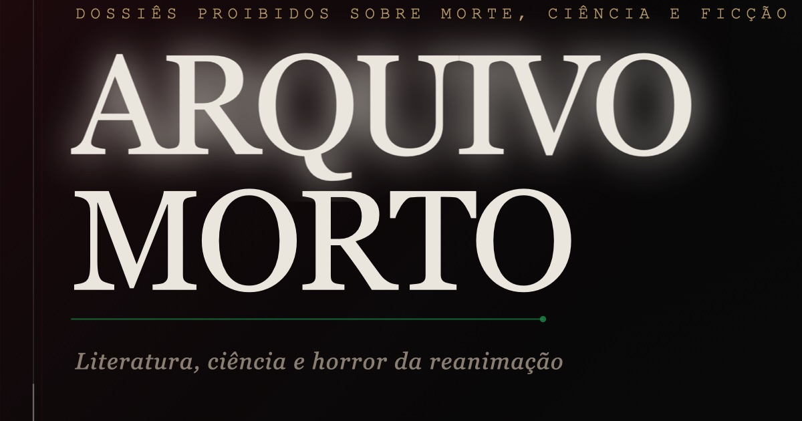

# Arquivo Morto

Projeto editorial dark sobre literatura, ciência, medicina histórica e horror da reanimação.



**Site em produção:** [arquivo-morto.netlify.app](https://arquivo-morto.netlify.app)

---

## Sobre o projeto

Arquivo Morto é um site editorial e cultural que cruza história da ciência, literatura gótica, medicina histórica, ocultismo e cinema de horror. O projeto mapeia a obsessão humana com a reanimação dos mortos — de Mary Shelley e o galvanismo do século XVIII até Romero, Re-Animator e Guillermo del Toro.

O tom é documental, frio e sombrio: cada seção trata o material como um arquivo real, com fichas, prontuários, registros e dossiês. A separação entre história documentada, literatura e ficção editorial é explícita em todos os capítulos.

### Principais temas cobertos

- Galvanismo e os experimentos de Giovanni Aldini com cadáveres (1803)
- Sergei Brukhonenko e o Autojektor soviético (anos 1930–1940)
- Robert E. Cornish e as tentativas de ressuscitação canina nos EUA
- Mary Shelley, Frankenstein e o imaginário galvanista
- Anatomia, vitalismo, ressurrecionistas e medicina do século XIX
- Necromancia, alquimia, autômatos e ocultismo renascentista
- Cinema de horror: Frankenstein (1910, 1931, 1994), Re-Animator (1985), Romero, Snyder, del Toro
- Bioética, morte técnica, criogenia e biotecnologia contemporânea

---

## Seções

| Seção | Conteúdo |
|---|---|
| Hero + Manifesto | Abertura editorial com metadados de arquivo |
| Cap. I — A humanidade contra a morte | Ritos funerários, Egito, Mesopotâmia, folclore, culturas ancestrais |
| Cap. II — Necromancia, alquimia e o desejo de retorno | Grimórios, John Dee, Golem, alquimia, elixires, autômatos |
| Cap. III — Do corpo sagrado ao corpo estudado | Relíquias, dissecação, escolas médicas, ressurrecionistas, vitalismo |
| Cap. IV — Galvanismo, medicina legal e sinais do cadáver | Galvani, Aldini, Ure, espasmo cadavérico, medicina legal |
| Cap. V — A morte técnica | UTI, transplantes, morte encefálica, criogenia, bioética, luto digital |
| Dossiê em destaque | Aldini-Forster, Londres, 1803 |
| Dossiê Cornish | Robert E. Cornish e a prancha de balanço |
| Dossiê Brukhonenko | Autojektor soviético, cães, cinema científico e bioética |
| Arquivo de casos | Seis registros editoriais curtos |
| Artigos | Ensaios sobre body snatchers, vitalismo, body horror, sonic horror |
| Linha do tempo | 1730–Hoje |
| Cinema | Frankenstein ao horror contemporâneo — 7 dossiês com imagens |
| Gabinete de Anatomia | Itens fictícios lacrados e catalogados |
| Nota de curadoria | Separação explícita entre fato, literatura e ficção editorial |

---

## Stack

- **React 19** — componente único com estado mínimo
- **Vite 8** — build ultrarrápido, CSS importado diretamente
- **CSS autoral** — sem Tailwind, sem frameworks de estilo; design system dark editorial completo
- **Netlify** — deploy estático, headers customizados em `public/_headers`

Sem dependências externas além de React. Sem bibliotecas de animação, sem preprocessadores CSS.

---

## Rodar localmente

```bash
npm install
npm run dev
```

Abre em `http://localhost:5173`

### Scripts disponíveis

| Comando | O que faz |
|---|---|
| `npm run dev` | Servidor de desenvolvimento padrão |
| `npm run dev:local` | Servidor fixo em `127.0.0.1:5173` |
| `npm run dev:open` | Sobe Vite e abre o navegador automaticamente |
| `npm run build` | Build de produção em `dist/` |
| `npm run preview` | Preview do build em `127.0.0.1:4173` |

---

## Build e deploy

```bash
npm run build
npm run preview
```

Para deploy: qualquer host estático serve. O projeto usa Netlify com deploy via CLI ou arrastar `dist/`.

---

## Estrutura

```
src/
  App.jsx        componente principal — todas as seções e dados editoriais
  App.css        design system dark completo (~4800 linhas)
  index.css      reset global mínimo

public/
  assets/
    archive/     imagens históricas (domínio público, Wikimedia Commons)
    cinema/      imagens curatoriais de cinema
  favicon.svg
  robots.txt
  sitemap.xml

docs/
  image-credits.md     créditos e URLs originais de todas as imagens
  editorial-direction.md

reports/
  screenshots/         screenshots de validação
```

---

## SEO e publicação

- Open Graph e Twitter Card configurados em `index.html`
- Imagem social: `public/arquivo-morto-share-v4.jpg` (1200×630)
- JSON-LD `CreativeWork` com autor, idioma e descrição
- `robots.txt` e `sitemap.xml` em `public/`
- URL canônica: `https://arquivo-morto.netlify.app/`

---

## Nota editorial

Arquivo Morto é um projeto cultural, artístico e editorial independente.

- Não é material médico, científico ou instrucional.
- Não ensina procedimento clínico ou experimental de nenhuma natureza.
- O projeto mistura história real documentada, literatura de domínio público, cinema e ficção editorial própria. Cada camada é identificada explicitamente no conteúdo.
- Imagens históricas são de domínio público (Wikimedia Commons); créditos completos em [`docs/image-credits.md`](docs/image-credits.md).
- Imagens de cinema são usadas como material curatorial/editorial do projeto, no contexto de análise cultural.

---

## Autor

Rafael Rodrigues — [github.com/rafael-backend-lab](https://github.com/rafael-backend-lab)
